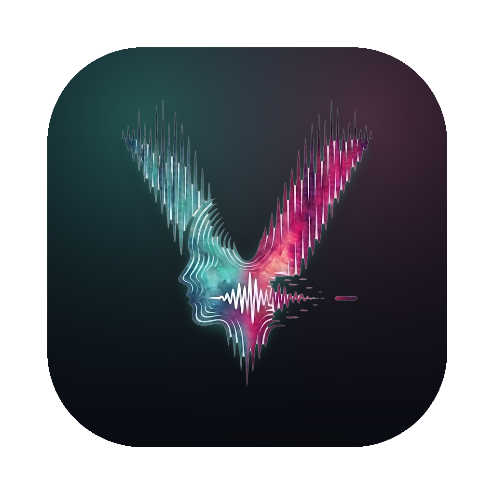
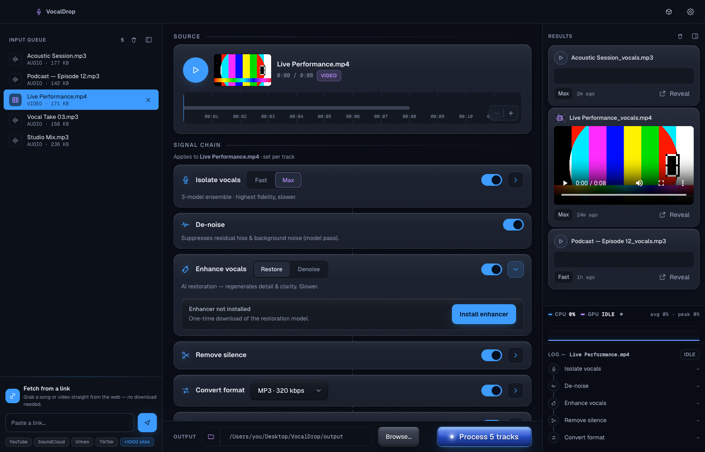

<p align="center">
  
</p>

<h1 align="center">VocalDrop — Free AI Vocal Remover for macOS</h1>

<p align="center">
  <strong>Remove vocals from any song, make acapellas, extract instruments, and clean up audio — 100% offline on your Mac.</strong>
</p>

<p align="center">
  <a href="https://github.com/App-Builders-Gang/vocaldrop/releases/latest"></a>
  <a href="https://github.com/App-Builders-Gang/vocaldrop/releases"></a>
  <a href="#"></a>
  <a href="#"></a>
  <a href="#"></a>
  <a href="https://github.com/App-Builders-Gang/vocaldrop/stargazers"></a>
</p>

<p align="center">
  <a href="#-installation">Install</a> ·
  <a href="#-features">Features</a> ·
  <a href="#-the-app">The app</a> ·
  <a href="#-why-vocaldrop">vs. other tools</a> ·
  <a href="#-faq">FAQ</a>
</p>

---

**VocalDrop** is a free **AI vocal remover and isolator for macOS** that runs entirely on your machine. Drag in any song or video, and state-of-the-art **RoFormer** neural models separate the vocals from the instruments in seconds — with **no uploads, no accounts, no quotas, and no watermarks**. It also converts between audio formats, removes silence, and chains all three into a single pass. Built native for Apple Silicon with automatic **Metal (MPS) GPU acceleration**.

Whether you're making a **karaoke track, an acapella, a clean instrumental, a podcast edit, or a stem for remixing**, VocalDrop gives you studio-grade separation without the subscription — your audio never leaves your Mac.

## ✨ Features

- 🎤 **Isolate vocals** — Two modes: **Fast** (a single BS-Roformer pass, quick and clean) or **Max** (a 3-model ensemble → blended → de-reverbed → de-noised/de-bleded for the highest fidelity).
- 🎛️ **Convert formats** — Transcode to `mp3`, `wav`, `flac`, `m4a`, `aac`, `ogg`, `opus`, or `aiff`, preserving metadata and cover art.
- 🤫 **Remove silence** — Adaptive silence detection with click-free crossfade welding — perfect for podcasts, lectures, and live recordings.
- 🔗 **Chain in one pass** — Isolate vocals → remove silence → convert, all in a single drag-and-drop run.
- 🎞️ **Video support** — Drop in a music video or movie clip; VocalDrop extracts audio, processes it, and can re-mux a synced video with the isolated vocal or instrumental track.
- 🖱️ **Finder Quick Actions** — Right-click any audio file → **Isolate Vocals** straight from Finder.
- ⌨️ **Full CLI** — Everything the app does is scriptable from the terminal (`vocaldrop vocals song.mp3 --quality max`), with `--json` output for pipelines.
- 🔒 **Private by design** — all processing runs locally; **your audio and files never leave your Mac**. No sign-up, no API key. (Anonymous crash & usage diagnostics help improve the app — no personal data, no file contents or paths.)

## 📸 The app

<p align="center">
  
</p>

<p align="center"><em>One window, whole workflow.</em> Drop a mix of <b>audio and video</b> into the queue, dial in the per-track signal chain — <b>isolate vocals → de-noise → AI enhance → remove silence → convert</b> — and every finished track lands in the Results feed, ready to play or reveal in Finder. Everything runs locally on your Mac.</p>

## 🆚 Why VocalDrop?

Most "free" vocal removers are websites that **upload your audio to someone else's server**. VocalDrop is different.

| | **VocalDrop** | Online tools (e.g. vocalremover.org) | Ultimate Vocal Remover (UVR5) | Moises | iZotope RX |
|---|:---:|:---:|:---:|:---:|:---:|
| **Local processing / files stay private** | ✅ | ❌ uploads your files | ✅ | ❌ cloud | ✅ |
| **Free** | ✅ | limited free tier | ✅ | paid | $$$ paid |
| **Native macOS app** | ✅ | browser only | ❌ Python/Tk GUI | ✅ | ✅ |
| **No watermarks / quotas** | ✅ | ❌ | ✅ | ❌ | ✅ |
| **Apple Silicon GPU (Metal)** | ✅ | n/a | manual setup | ✅ | ✅ |
| **One-click install** | ✅ DMG | n/a | ❌ dev setup | ✅ | ✅ |
| **No account / login** | ✅ | ⚠️ often required | ✅ | ⚠️ required | ✅ |

Looking for a **free UVR5 alternative for Mac**, a **private Moises alternative**, or an **offline vocal remover with no upload**? That's VocalDrop. (VocalDrop uses the same RoFormer model family as UVR5, but ships as a polished, native Mac app — no Python setup required.)

## 📥 Installation

### Option 1 — Download the app (recommended)

1. Go to the [**latest release**](https://github.com/App-Builders-Gang/vocaldrop/releases/latest) and download **`VocalDrop-<version>-arm64.dmg`**.
2. Open the DMG and drag **VocalDrop** into **Applications**.
3. ⚠️ **First launch:** this build is not yet code-signed. macOS will show *"VocalDrop cannot be opened because it is from an unidentified developer."* To open it: **right-click (or ⌃-click) the app → Open → Open anyway.** (Signed + notarized builds are on the roadmap.)
4. The first run downloads the AI engine and models (~2 GB, one-time) — after that VocalDrop is **fully offline**.

> **Verify the download:** run `shasum -a 256 VocalDrop-*-arm64.dmg` and compare it to the matching `.sha256` file in the release assets.

**Requirements:** macOS on **Apple Silicon** (M1/M2/M3/M4) and [ffmpeg](https://formulae.brew.sh/formula/ffmpeg) (`brew install ffmpeg`). Python 3.9–3.12 is provisioned automatically on first launch.

> VocalDrop is **free to use** and distributed as a ready-made Mac app — no build step needed. (It's closed source; the public repo holds releases, screenshots, and this README.)

## 🚀 Quick start

**In the app:** drag an audio or video file onto the window → tick **Isolate / Silence / Convert** → press **Process**. Done.

**From the CLI** (bundled inside the app at `VocalDrop.app/Contents/Resources/bin/vocaldrop` — add it to your `PATH` or use the Finder Quick Actions installer):
```bash
# Isolate vocals — fast (seconds) or max (best quality)
vocaldrop vocals song.mp3 --quality fast
vocaldrop vocals song.mp3 --quality max

# Convert formats (metadata + cover art preserved)
vocaldrop convert song.wav --to mp3 --bitrate 320k

# Remove silence
vocaldrop silence talk.m4a --threshold -40dB --min 0.5

# Chain everything in one pass
vocaldrop run song.mp3 --vocals=max --silence --convert mp3 --out ~/Desktop/out
```
Add `--json` to any command for machine-readable progress.

## 🧠 How it works

VocalDrop is built on the **RoFormer** family of separation models — the same state-of-the-art architecture behind the best commercial stem-separation tools.

- **Fast mode** runs a single high-SDR BS-Roformer pass. Great for clean sources and near-real-time on Metal.
- **Max mode** runs a **3-model ensemble**: three specialized RoFormer checkpoints are each run, then their vocal estimates are **blended** (via weighted averaging in `ensemble.py`), **de-reverbed**, and **de-noised / de-bleded** for the cleanest possible stem.

All inference runs through [audio-separator](https://github.com/nomadkaraoke/python-audio-separator) with **Metal (MPS) acceleration**, falling back to CPU per-op where needed (`PYTORCH_ENABLE_MPS_FALLBACK`). Under the hood it's an **Electron** shell over a **Deno** engine sidecar, with a matching **CLI** — so the same engine powers the GUI and your scripts.

## 🔒 Privacy & system requirements

- **Privacy:** **Your audio never leaves your Mac** — all separation, conversion, and cleanup run locally; no cloud, no account. VocalDrop collects **anonymous diagnostics** (crash reports and basic usage events, via Google) to fix bugs and improve the app — never your file contents, file paths, or any personal data. Other network access is limited to the one-time engine/model download on first launch, online URL ingest when you paste a link, and the optional "check for updates" toggle.
- **System:** macOS on **Apple Silicon** (M-series). Intel/Windows/Linux support is on the roadmap.
- **Disk:** ~2 GB for the full model set (Fast mode needs only ~200 MB).
- Runtime state (Python venv, temp files, default output) lives in `~/Library/Application Support/VocalDrop/`.

## ❓ FAQ

**Is my audio uploaded anywhere?**
No. VocalDrop runs entirely on your Mac. The first launch downloads the AI models once; after that it's fully offline.

**Does it use the GPU?**
Yes — on Apple Silicon it uses Metal (MPS) automatically. You can force CPU in Settings → Engine if you prefer.

**Is it really free?**
Yes — free to use for everyone. No ads, no watermarks, no subscription, no feature paywall, no account. (VocalDrop is closed source; it's just given away free.)

**Windows / Linux / Intel Mac?**
Not yet — currently Apple Silicon only. Intel Mac, Windows, and Linux builds are on the roadmap.

**Why do I get an "unidentified developer" warning?**
The current build isn't code-signed/notarized yet. Right-click the app → **Open** to bypass Gatekeeper. Signed builds are coming.

**How is this different from Ultimate Vocal Remover (UVR5)?**
Same underlying RoFormer models, but VocalDrop is a **native, polished macOS app** with drag-and-drop, video support, format conversion, silence removal, and Finder integration — no Python/Tkinter setup required.

## 🛣️ Roadmap

- [ ] Code-signing & notarization (no Gatekeeper warning)
- [ ] Intel Mac, Windows, and Linux builds
- [ ] In-app auto-update (Sparkle)
- [ ] Real-time preview before committing a full render
- [ ] More separation tasks (drums, bass, piano)

## 🤝 Feedback

VocalDrop is free to use and closed source. This repo hosts the downloads, screenshots, and this README — so **bug reports and feature requests are very welcome** in the [Issues](https://github.com/App-Builders-Gang/vocaldrop/issues).

## 📄 License & acknowledgements

VocalDrop is **free to use** software (closed source) © 2026 App Builders Gang.

It stands on the shoulders of giants:
- The **RoFormer** separation models and their authors.
- [**audio-separator**](https://github.com/nomadkaraoke/python-audio-separator) — the inference engine.
- [Deno](https://deno.land), [Electron](https://www.electronjs.org/), [ffmpeg](https://ffmpeg.org/), and [resemble-enhance](https://github.com/resemble-ai/resemble-enhance).

> ⭐ If VocalDrop saves you a subscription, give it a star and tell a producer friend.
